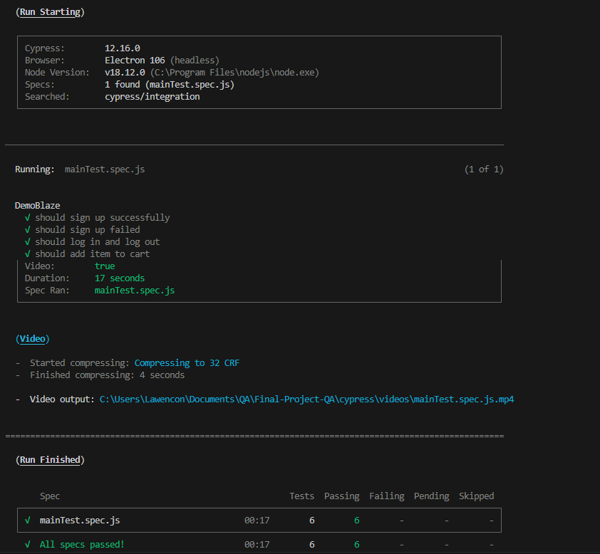

Kelompok 11

Test plan doc: https://docs.google.com/spreadsheets/d/1Dlw12hT8p7gMKYfwiL8yCknZj_hsvRiIGBEnZG7qW4c/edit?usp=sharing

Team member: Aulia Bayu M, Yuan H Siagian, Sudaryadi, Puput Yuniar Maulida, Arif hamidan

#How To Run
1. npm init
2. npm install
3. npm install cypress --save-dev
4. npx cypress run or npm cypress open

#how to get result using mochawesome
1. npm install --save-dev mochawesome
2. npm install --save-dev mocha@5.2.0
3. npm cypress run --reporter mochawesome
4.you can see the result at folder mochawesome-report